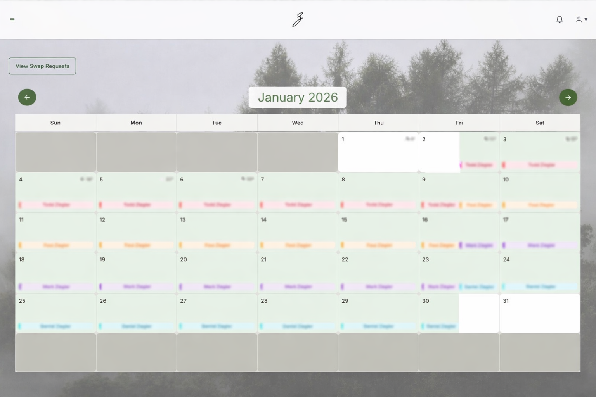
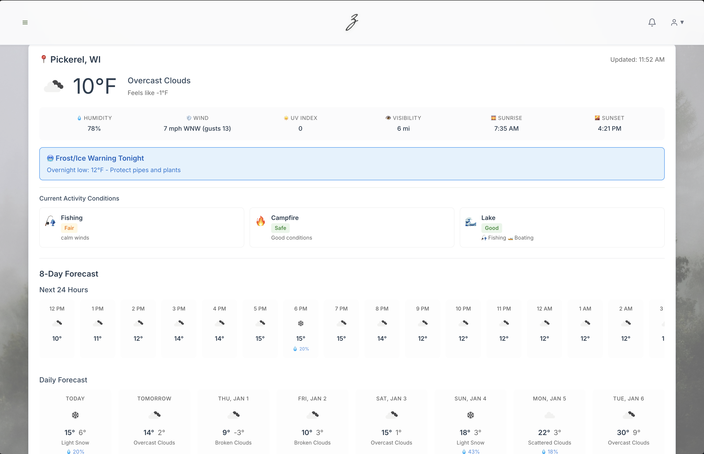

# 🏕️ Ziegler Family Cabin

A modern web app for managing our family cabin — reservations, photo sharing, maintenance tracking, and more.

**Live Site:** [zieglercabin.com](https://zieglercabin.com)

---

## ✨ Features

### 📅 Reservation Calendar
Book your cabin stay with an interactive calendar. See who's visiting when, request swaps with family members, and get 8-day weather forecasts for planning.

### 📸 Photo Gallery
Share memories from your visits. Bulk upload photos, browse the family collection, and relive great moments at the cabin.

### 💬 Message Board
Stay connected with family updates. Post messages, share news, and coordinate plans — everyone gets notified.

### 🌤️ Weather Dashboard
Plan your activities with detailed weather info including fishing conditions, campfire weather, and lake conditions.

### 🔧 Maintenance Tracking
Keep the cabin in great shape. Log maintenance tasks, track what needs attention, and coordinate repairs.

---

## 🛠️ Tech Stack

- **Frontend:** React 18 + TypeScript + Vite
- **Backend:** Supabase (Auth, Database, Storage)
- **Hosting:** Vercel
- **Email:** Resend
- **Weather:** OpenWeather API

---

## 👨‍👩‍👧‍👦 Family Access

This is a private family app. To get access:
1. Ask a family member to send you an invitation
2. Check your email (including junk folder)
3. Click the registration link and create your account

---

Made with ❤️ for the Ziegler family
